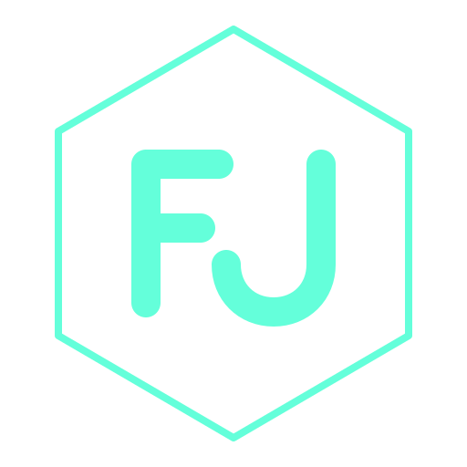

<div align="center">
  
</div>
<h1 align="center">
  Firman JK - Developer & Data Engineer
</h1>
<p align="center">
  Personal portfolio website of <a href="https://firmanjk.fun/" target="_blank">FirmanJK</a>
</p>

<p align="center">
  A developer who builds things end to end - from progressive web apps and Android deployments to machine learning-integrated mobile platforms.
</p>

## 🚀 About

Hi, I'm Firman — a fullstack developer and data engineer who specializes in building end-to-end solutions. With expertise in PWA development, Android deployments, and machine learning integration, I create projects that solve real problems for real institutions.

**Focus Areas:**

- 📱 Progressive Web Apps (PWA)
- 🤖 Android Development & Mobile Apps
- 🧠 Machine Learning Integration
- 📊 Data Engineering & Analytics
- 🤖 Artificial Intelligence Solutions
- 🌐 Full-Stack Web Development

**Featured Projects:**

- **Marketplace Jawara** - Community governance solution with integrated marketplace
- **Talent Hub** - Professional digital career ecosystem
- **Pintara Kids** - Interactive educational platform for children
- **Internify** - Internship management system with intelligent matching
- **Sibeta** - Digital repository and clearance portal

## 🛠 Installation & Set Up

1. Install the Gatsby CLI

   ```sh
   npm install -g gatsby-cli
   ```

2. Install and use the correct version of Node using [NVM](https://github.com/nvm-sh/nvm)

   ```sh
   nvm install
   ```

3. Install dependencies

   ```sh
   yarn install
   ```

4. Start the development server

   ```sh
   npm start
   ```

   Open [http://localhost:8000](http://localhost:8000) to view it in the browser.

## 🚀 Building and Running for Production

1. Generate a full static production build

   ```sh
   npm run build
   ```

2. Preview the site as it will appear once deployed

   ```sh
   npm run serve
   ```

   Open [http://localhost:9000](http://localhost:9000) to view it in the browser.

3. Deploy to GitHub Pages

   ```sh
   npm run deploy
   ```

## 💻 Tech Stack

**Frontend:**

- React
- Gatsby
- Styled Components
- GraphQL

**Tools & Libraries:**

- Anime.js (animations)
- ScrollReveal (scroll animations)
- Prism.js (syntax highlighting)
- gatsby-plugin-image (image optimization)

**Deployment:**

- GitHub Pages
- Netlify (alternative)

## 🎨 Color Reference

| Color          | Hex       |
| -------------- | --------- |
| Navy           | `#0a192f` |
| Light Navy     | `#112240` |
| Lightest Navy  | `#233554` |
| Slate          | `#8892b0` |
| Light Slate    | `#a8b2d1` |
| Lightest Slate | `#ccd6f6` |
| White          | `#e6f1ff` |
| Green          | `#64ffda` |

## 📁 Project Structure

```
portfolio/
├── content/              # Markdown content
│   ├── featured/        # Featured projects
│   ├── jobs/            # Work experience
│   ├── posts/           # Blog posts
│   └── projects/        # Other projects
├── src/
│   ├── components/      # React components
│   ├── images/          # Images and assets
│   ├── pages/           # Page components
│   ├── styles/          # Global styles
│   └── config.js        # Site configuration
├── gatsby-config.js     # Gatsby configuration
└── gatsby-node.js       # Gatsby Node APIs
```

## 📝 Customization

To customize this portfolio for your own use:

1. Update personal information in `src/config.js`
2. Replace profile photo in `src/images/me.png`
3. Update experience in `content/jobs/`
4. Update projects in `content/featured/` and `content/projects/`
5. Update site metadata in `gatsby-config.js`

For detailed instructions, see `MULAI_DISINI.md`

## 🐛 Troubleshooting

**Issue: Changes not showing up**

```sh
npm run clean
npm start
```

**Issue: Build errors**

```sh
npm run clean
rm -rf node_modules
yarn install
npm run build
```

## 📞 Contact

- **Email:** jatikusuma76@gmail.com
- **GitHub:** [@FirmanJotab-Repositories](https://github.com/FirmanJK)
- **LinkedIn:** [Modhammad Firman Dika Jati Kusuma](https://www.linkedin.com/in/mochammad-firmandika-jati-kusuma-9ba1b724b/)
- **Instagram:** [@dika\_\_dik](https://www.instagram.com/dika__dik?igsh=NmMzM2M3MHNmbjZ6)

## 📄 License

This project is open source and available under the [MIT License](LICENSE).
